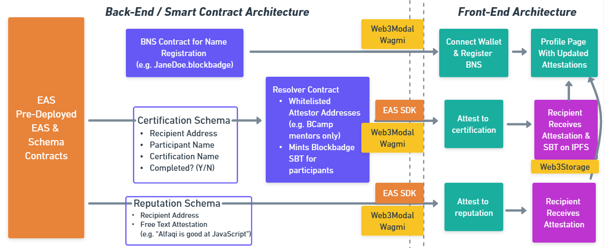

# BlockBadge

BlockBadge is a blockchain-based certifications and reputation web application, designed to efficiently, securely, and transparently connect recruiters and employers to applicants. The unique feature of BlockBadge lies in its attestation-based system, utilizing Ethereum Attestation Service (EAS) where reputation and certification data are created based on attestations from verified Ethereum addresses. BlockBadge relies on the security, transparency, and immutability of the blockchain, as well as the strength and reputability of blockchain-based attestations made by verified participants in the network.

> Proof of Excellence, Verified Securely

## BCamp Assignments

This project was created during the BCamp Apprenticeship, which combines elements of both a traditional internship and a hackathon to provide a personalized learning experience, professional networking opportunities, insights into blockchain development, and job opportunities. Below are the assignments completed throughout the program.

| Week | Assignment | Presenation/GitHub Link |
|------|-------------|-----------------|
| 2 | Project Proposal | [Link to Presentation](https://docs.google.com/presentation/d/1QBR_kAvniN0PuxweowttrUHoNNaMl3SRLyHr3U9vaFk/edit#slide=id.p) |
| 3 | Pseudo Smart Contract Code | [Link to Presentation](https://docs.google.com/presentation/d/1szP8YQsMTDqG2RWid3YyQsXLAF2i0LyahC2TUVJldsw/edit#slide=id.g2886e795b44_0_1299) |
| 4 | Smart Contract Tests | [Link to Presentation](https://block-badge-ppt-pnp3.vercel.app/ppt/02) |
| 5 | Front-End Development | [Link to Font End Site](https://sept23-apprenticeship-certification-git-dev-alfaqis-projects.vercel.app/) |
| 6 | Smart Contract Security Review | [Link to Securiy Review GitHub](https://github.com/0xBcamp/Sept23_Apprenticeship_Certification/tree/BlockAudit-Security-Review/blockaudit-main) |

## Table of Contents
- [Installation & Running the Application](#installation--running-the-application)
- [Basic Usage](#basic-usage)
- [Enhanced Insights into BlockBadge](#enhanced-insights-into-blockbadge)
- [Features and Functionality](#features-and-functionality)
- [Streamlined Architecture](#streamlined-architecture)
- [User Experience](#user-experience)
- [Integrated Technologies](#integrated-technologies)
- [Collaborators](#collaborators)
- [License](#license)

## Installation & Running the Application

1. Download the project repository by either [downloading the zip file](https://github.com/0xBcamp/Sept23_Apprenticeship_Certification/archive/refs/heads/main.zip) or using Git to [clone the repository](https://github.com/0xBcamp/Sept23_Apprenticeship_Certification.git) (green "<>Code" button > Clone with HTTPS, SSH, or GitHub CLI)
2. Navigate to the project directory in your terminal: **cd Sept23_Apprenticeship_Certification**
3. After installing the dependencies, start the app: **npm run dev**
4. Open your web browser and go to: [http://localhost:3000](http://localhost:3000)

Make sure you have Node.js and other necessary dependencies installed and linked.

## Basic Usage

BlockBadge provides the following high-level functionalities. Continue reading below sections for more information.

- Connect your crypto wallet to perform transactions
- Utilize the Blockchain Naming Service (BNS) to register your account
- Make or receive certifications (including soulbounf NFT) or reputation attestations
- Navigate your dynamic profile to review your certifications and reputation attestations

## Enhanced Insights into BlockBadge

### What

BlockBadge serves as an all-in-one recruiting solution, providing comprehensive credential verification and applicant reputation assessment.

### Why

In response to the inefficiencies and opacity of traditional tech recruiting methods, BlockBadge strives to introduce a new standard of transparency in verifying skills and conducting background checks.

### How

We prioritize transparency, security, and robust data validation by leveraging Blockchain-based Attestation, supported by the Ethereum Attestation Service.

### Solutions Offered

- Streamlined Employment Evaluation Processes
- Elimination of Dependence on Applicant Tracking Systems (ATS)
- Simplified Referral Assessment Procedures
- Direct, Trustworthy Interaction without Third-Party Intermediaries

## Features and Functionality

1. **Certification Attestation:**
   Users can make certification attestations for various programs. If the attester's address is whitelisted in the smart contract, they can attest to specific certifications. For instance, BCamp mentors with whitelisted addresses can endorse BCamp apprentices, and the certified apprentice also receives a unique BlockBadge soulbound token (BlockBadge SBT). This non-transferable NFT can be stored in their wallet and showcased when necessary.

2. **Reputation Attestation:**
   Users can provide reputation attestations for any Ethereum address using simple free text. Unlike certification attestations, reputation attestations are not restricted to specific addresses or conditions.

3. **Profile Page/Registration:**
   By leveraging the Blockchain Naming Service (BNS), users can link their wallet address and register on BlockBadge to acquire a personalized blockbadge name (e.g., JohnathanSmith.blockbadge). This enables users to easily naviagate profile pages, and make attestations utilizing simple naming conventions tied to verified ethereum addresses.

4. **Search Navigation:**
   Users can utilize BlockBadge names (BNS) and other crypto wallet addresses to seamlessly navigate through various profiles.

5. **LinkedIn Badge Integration:**
   BlockBadge facilitates the incorporation of blockchain-based information into LinkedIn badges. This integration allows organizations to enhance their badge criteria with verified data from the BlockBadge network, emphasizing transparency and security.

## Streamlined Architecture

BlockBadge's streamlined architecture comprises:

- Smart contract for BNS registration and naming convention, which ultimately links to the frontend user profile and search navigation features
- Two distinct schemas for both certifications and reputations within the Ethereum Attestation Service (EAS) infrastructure
- Smart contracts for certifications, incorporating a resolver contract that 1) whitelists specific addresses for making attestations (e.g., BCamp mentors whitelisted addresses only can attest to BCamp apprentices) 2) mints a unique non-trasnferrable soulbound NFT token for the given certification, which is stored in IPFS
- Smart contracts for reputations, enabling direct and simple free text attestations
- EAS Software Development Kit (SDK) for direct and secure attestations linked to the frontend, and ultimately the user profile

## User Experience

### Employer/Recruiter Experience

| Key Features/Functionalities |
|-----------------------------|
| Transparent Verification Process |
| Streamlined Skill Evaluation |
| Easy Access to Validated Candidate Data via Seach Navigation & BNS Features|

### Applicant Experience

| Key Features/Functionalities |
|-----------------------------|
| Secure and Transparent Profile Management |
| Easy Reputation and Certification Attestation Process |
| Real-Time Profile Updates for Attestations |
| Collection of BlockBadge SBT for Securely Showcasing and Storing Certifications |
| LinkedIn Badge Integration that utilizes blockchain-based data for LinkedIn badges, showcasing Certifications |

## Integrated Technologies

- Solidity Smart Contracts for both Certifications and Reputation Attestation
- Ethereum Attestation Service (EAS) Architecture and SDK
- Apollo Client for efficient data fetching and management
- Web3Storage for IPFS management of SBT certification images
- Web3Modal for simplified Ethereum wallet integration and management
- Wagmi for Ethereum-based application integration and configuration
- React and Next.js for the Front-End Interface
- Tailwind CSS for an intuitive and streamlined styling experience

## Collaborators

- [Harold](https://github.com/thanvinhbaohoang): BCamp Mentor
- [Aliraza](https://github.com/alirazacodes): Full-Stack Developer & Security Architect
- [Alfaqi](https://github.com/alfaqi): Front-End Developer
- [Manraj](https://github.com/hobbes928): Back-End Developer
- [Theresa](https://github.com/theresa-whynot): Project Manager & Code Reviewer

## License

This project is licensed under the [MIT](https://opensource.org/licenses/MIT) License - see the [LICENSE](LICENSE) file for details.
